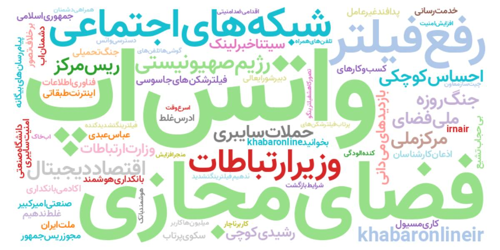

# تولید ابر واژگان (WordCloud) فارسی با استفاده از BERTopic و ParsBERT

این ابزار برای پردازش محتوای متنی فارسی (مثلاً پیام‌های تلگرام) و تولید یک ابر واژگان از کل داده طراحی شده است. مدل BERTopic به همراه UMAP و مدل زبان ParsBERT برای تحلیل موضوعی و استخراج ترکیبات رایج به‌کار رفته است.

---

## پیش‌نیازها

پیش از اجرای پروژه، اطمینان حاصل کنید که پایتون نسخه 3.7 یا بالاتر روی سیستم شما نصب است.

### نصب کتابخانه‌ها

```bash
pip install -r requirements.txt
````

محتوای فایل `requirements.txt` پیشنهادی:

```
pandas
bertopic
umap-learn
torch
transformers
wordcloud
matplotlib
nltk
```

> همچنین لازم است که فونت فارسی مانند `Vazir-Bold.ttf` در پوشه پروژه یا مسیر مشخص‌شده در کد موجود باشد.

---

## ساختار فایل‌ها

```
.
├── main.py                    # نقطه شروع اجرای برنامه
├── generate_wordcloud.py      # کد اصلی برای ساخت wordcloud
├── embedder.py                # کلاس ParsBERTEmbedder برای تولید بردارها
├── preprocess.py              # تابع پیش‌پردازش متن
├── utils.py                   # محاسبه وزن‌های n-gram و PMI
├── wordclouds/                # پوشه خروجی برای تصاویر
└── README.md                  # فایل راهنما (همین فایل)
```

---

## ورودی مورد انتظار

فایل CSV با حداقل یک ستون به‌نام:

* `txtContent` — شامل محتوای متنی فارسی

مثال:

| txtContent                            |
| ------------------------------------- |
| این یک متن تستی برای تحلیل است.       |
| موضوعات مختلف در پیام‌ها دیده می‌شود. |

---

## اجرای برنامه

```bash
python main.py مسیر/به/فایل.csv
```

پس از اجرا، تصویری از ابر واژگان در مسیر `wordclouds/wordcloud_all_data.png` ذخیره می‌شود.

---

## نکات

* از مدل [ParsBERT](https://huggingface.co/HooshvareLab/bert-base-parsbert-uncased) برای برداردهی استفاده شده است.
* کلمات دوگانه (2-gram) رایج به همراه وزن‌دهی بر اساس **PMI** و توزیع موضوعات استخراج می‌شوند.
* خروجی به زبان فارسی و با فونت مناسب تولید می‌شود.

---

## نمونه خروجی

تصویر زیر نمونه‌ای از خروجی تولیدشده توسط برنامه را نشان می‌دهد:



